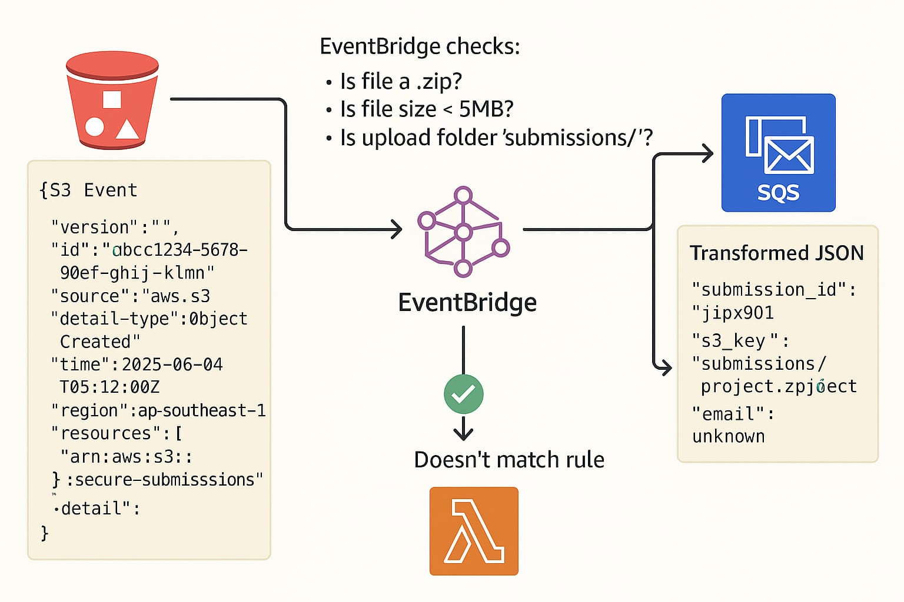

# 📦 S3 → EventBridge → SQS → Lambda Pipeline (Detailed Guide)

This guide walks you through setting up a pipeline that responds to `.zip` file uploads in an S3 bucket. When a student uploads a zip file, the system sends a custom message to an SQS queue using EventBridge, and that message triggers a Lambda function.



---

## 🗂️ Architecture Overview

```
S3 (PutObject: *.zip)
   ↓
EventBridge Rule (ObjectCreated)
   ↓ (with custom JSON)
SQS Queue (student-submission-queue)
   ↓
Lambda Function (ProcessStudentSubmission)
```

---

## ✅ Prerequisites

- An AWS account with access to:
  - **Amazon S3**
  - **Amazon EventBridge**
  - **Amazon SQS**
  - **AWS Lambda**
- Permissions to create IAM roles and policies
- Basic understanding of AWS Console navigation

---

## 🛠️ Step-by-Step Setup

### 1. Enable EventBridge Notifications for S3
---

### 📥 Sample Event Sent from S3 to EventBridge

When a `.zip` file is uploaded to the `student-submissions` bucket, the following event is sent to EventBridge:

```json
{
  "version": "0",
  "id": "4e768c71-0bd1-14a6-6be7-89c047bfeabc",
  "detail-type": "Object Created",
  "source": "aws.s3",
  "account": "123456789012",
  "time": "2025-06-07T06:23:15Z",
  "region": "ap-southeast-1",
  "resources": [
    "arn:aws:s3:::student-submissions"
  ],
  "detail": {
    "version": "0",
    "bucket": {
      "name": "student-submissions"
    },
    "object": {
      "key": "jipx901/assignment1.zip",
      "size": 2438192,
      "etag": "22b53f5d1e8a9f2f3d446c2fa1b22389",
      "sequencer": "005F245F3E3A3A1D27"
    },
    "request-id": "F20C12345A1B88AC",
    "requester": "arn:aws:iam::123456789012:user/student",
    "source-ip-address": "203.0.113.14",
    "reason": "PutObject",
    "destination-region": "ap-southeast-1"
  }
}
```

#### 🔍 Key Fields You Can Use in the Input Transformer

| Field             | JSONPath                          | Description                          |
|------------------|-----------------------------------|--------------------------------------|
| `bucket.name`     | `$.detail.bucket.name`            | Name of the S3 bucket                |
| `object.key`      | `$.detail.object.key`             | The path/key of the uploaded object  |
| `time`            | `$.time`                          | Timestamp of upload (UTC)            |


1. Go to **S3 Console**
2. Click the bucket named `student-submissions`
3. Select the **Properties** tab
4. Scroll to **Event notifications**
5. Click **Edit**
6. Enable **"Send events to Amazon EventBridge"**
7. Click **Save changes**

This allows S3 to emit events to EventBridge when new objects are created.

---

### 2. Create an SQS Queue

1. Go to **Amazon SQS Console**
2. Click **Create queue**
3. Select:
   - **Queue type**: Standard
   - **Name**: `student-submission-queue`
4. Click **Create Queue**
5. Note the **Queue ARN** for later use

---

### 3. Create an EventBridge Rule

1. Go to **Amazon EventBridge Console**
2. In the left panel, click **Rules**
3. Click **Create rule**

#### Basic Info

- **Name**: `s3-zip-upload-rule`
- **Event bus**: `default`
- **Rule type**: `Rule with an event pattern`

Click **Next**

---

### 4. Define the Event Pattern

1. Choose:
   - **Service provider**: AWS
   - **AWS service**: S3
   - **Event type**: Object Level Operations
2. Click **Edit pattern** and paste the following:

```json
{
  "source": ["aws.s3"],
  "detail-type": ["Object Created"],
  "detail": {
    "bucket": {
      "name": ["student-submissions"]
    },
    "object": {
      "key": [{"suffix": ".zip"}]
    }
  }
}
```

This filters events to only trigger when `.zip` files are uploaded to your bucket.

Click **Next**

---

### 5. Add Target: SQS and Input Transformer

1. Choose **Target type**: AWS service
2. **Service**: SQS queue
3. **Queue**: Select `student-submission-queue`

Scroll to **Additional settings** → click **Transform input**


#### Input Paths Map:

```json
{
  "timestamp": "$.time",
  "key": "$.detail.object.key",
  "bucket": "$.detail.bucket.name"
}
```

#### Input Template:

```json
{
  "submission_id": <timestamp>,
  "s3_key": <key>,
  "bucket": <bucket>
}
```

Click **Confirm** → **Next** → **Create rule**

---

### 6. Update the SQS Queue Policy to Allow EventBridge

1. Go to **SQS Console** → Choose your `student-submission-queue`
2. Click **Access Policy** → Edit
3. Add the following policy (replace `REGION` and `ACCOUNT_ID`):

```json
{
  "Version": "2012-10-17",
  "Statement": [
    {
      "Sid": "AllowEventBridge",
      "Effect": "Allow",
      "Principal": {
        "Service": "events.amazonaws.com"
      },
      "Action": "SQS:SendMessage",
      "Resource": "arn:aws:sqs:REGION:ACCOUNT_ID:student-submission-queue"
    }
  ]
}
```

Click **Save**

---

### 7. Create and Connect a Lambda Function

1. Go to **Lambda Console**
2. Click **Create function**
   - **Name**: `ProcessStudentSubmission`
   - **Runtime**: Python 3.x (or Node.js, etc.)
   - **Execution role**: Create or use an existing role with access to SQS

Paste this sample code:

```python
import json

def lambda_handler(event, context):
    for record in event['Records']:
        body = json.loads(record['body'])
        print("📥 New submission received:")
        print("Submission ID:", body['submission_id'])
        print("S3 Key:", body['s3_key'])
        print("Bucket:", body['bucket'])
```

Click **Deploy**

---

### 8. Add SQS Trigger to Lambda

1. Go to the Lambda function → **Configuration** tab
2. Click **Add trigger**
3. Choose **SQS**
4. Select `student-submission-queue`
5. Click **Add**

---

### 9. Grant Lambda Permissions to Read from SQS

Ensure the Lambda execution role has the following inline policy:

```json
{
  "Effect": "Allow",
  "Action": [
    "sqs:ReceiveMessage",
    "sqs:DeleteMessage",
    "sqs:GetQueueAttributes"
  ],
  "Resource": "*"
}
```

---

## ✅ Test Case: Upload and Observe

### Test Scenario

1. Upload a `.zip` file (e.g., `jipx901/assignment1.zip`) to the `student-submissions` S3 bucket.

### Expected Outcome

1. EventBridge rule triggers and sends a message to SQS:
```json
{
  "submission_id": "2025-06-07T14:00:00Z",
  "s3_key": "jipx901/assignment1.zip",
  "bucket": "student-submissions"
}
```

2. SQS triggers Lambda
3. Lambda logs the message in CloudWatch:

```
📥 New submission received:
Submission ID: 2025-06-07T14:00:00Z
S3 Key: jipx901/assignment1.zip
Bucket: student-submissions
```

---

## ✅ Next Steps (Optional)

- Add Dead Letter Queue (DLQ) to SQS
- Add automated S3 object scanner (e.g., virus scan or unzip Lambda)
- Tag messages with user identity using event context

---

Let me know if you'd like this deployed via Terraform, SAM, or CloudFormation.