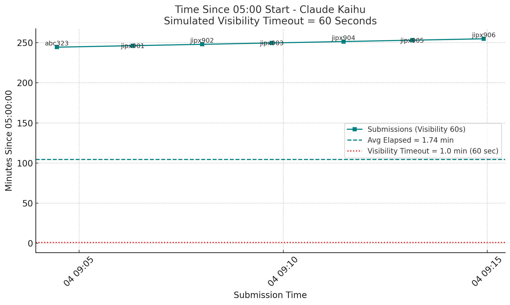
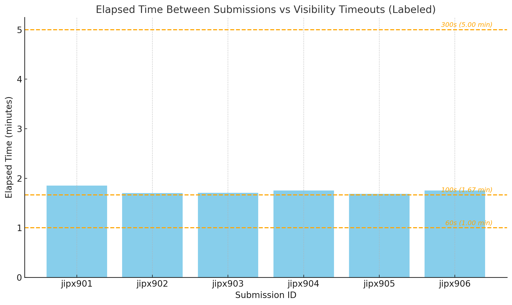

The updated chart now includes:

Submission IDs at each point.

Average elapsed time (dashed red line), which is approximately 5.71 minutes.

A clear model annotation: Model: Claude 3.5 Sonnet.

📉 Average Elapsed Time
Average time between submissions: ~2.42 minutes

This is less than half the average of Claude 3.5 Sonnet (~5.71 min), suggesting faster throughput or burst processing.

## SQS Visibility Window

📌 Notes
Once the timeout expires, the message becomes visible again if it hasn't been deleted — leading to retries.

Setting too short a visibility timeout can result in duplicate processing if Lambda doesn’t finish on time.

Setting too long a timeout can delay retries if something goes wrong (e.g., Lambda crashes).

📊 Key Observations:
🟣 Submission IDs are plotted with alternating labels to reduce overlap.

🟪 Dashed line shows average submission interval: ~1.74 minutes.

🟧 Dotted line at 1.67 minutes marks the new SQS visibility timeout (100 seconds).

🔍 Interpretation:
Your average interval is slightly above the visibility timeout.

This means:

In edge cases, some messages may reappear in the queue before they're successfully deleted.

There's a higher risk of retry/duplicate execution, especially if the Lambda is slow or delayed.

The tight timing suggests that fine-tuning processing time or increasing timeout may help reduce unintended retries.

Here's the simulation chart for SQS visibility timeout = 60 seconds (1.0 minute):

🔍 Key Observations:
🔴 Red dotted line marks the 1.0 minute visibility timeout threshold.

🟦 Average submission interval is ~1.74 minutes — still above the timeout.

❗ This increases the chance of retries, as messages could reappear before the function completes (especially if Lambda is slow or delayed).

All submission markers are well above the timeout line, highlighting the risk in high-throughput or delayed processing conditions.

🔍 Conclusion:
A visibility timeout of 60s will almost guarantee retries under this submission pattern.

100s visibility might still result in retries for messages taking longer to process.

300s provides the most resilience but increases latency in handling failures.